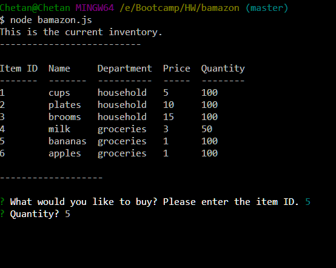
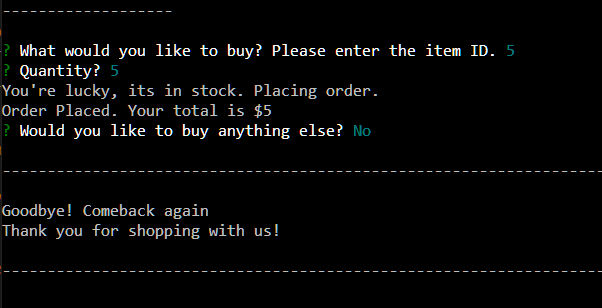
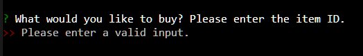
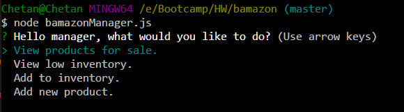
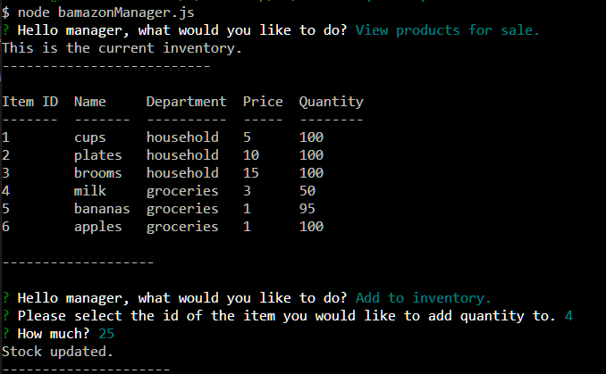
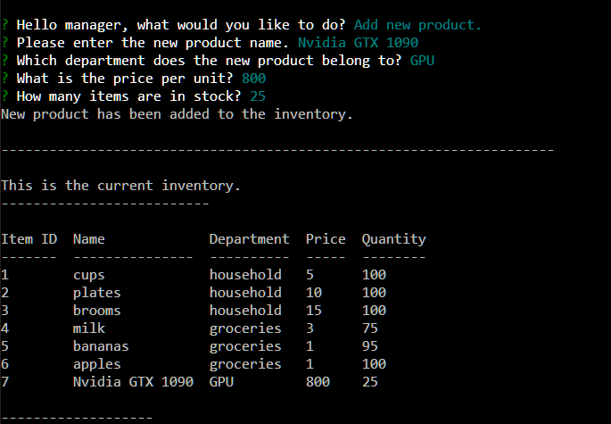
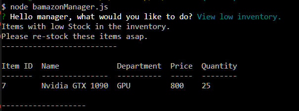

# Bamazon
Bamazon is a CLI store-front app that depicts the process of shopping from a store. It runs on node.js and MYSQL database. There are two main modes in this app - Customer and Manager.

## Customer
In the customer mode, the app displays the current inventory and the purchase of an item can be made by the customer. It asks for the item id and the quantity. It takes in the user input of quantity and checks against the available stock in the database. It proceeds with the purchase if the item is in stock or it shows a "not enough stock" message if the item is not in stock.

.PNG)

There is an added functionality of user input validation. For example, a customer cannot input letters when the application is asking for the item id which is a number.

## Manager
The manager mode has 4 functions - view the entire inventory, view only the items less in stock (less than 25), add more stock to a pre-existing item and add a brand new item with the department, price and stock.

Here is the landing screen for the manager mode.

Adding stock to a pre-existing

Adding a new item

Viewing inventory of items with low stock

This too has user input validation, so be aware.

## Under the hood

* [inquirer](https://www.npmjs.com/package/inquirer) - Prompts for the input.
* [mysql](https://www.npmjs.com/package/mysql) - Package for the MYSQL database
* [console.table](https://www.npmjs.com/package/console.table) - To display the inventory in a table format.
